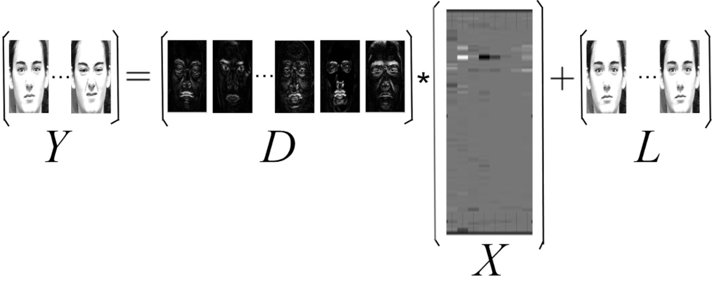

###Joint Sparse and Low-Rank representation for emotion recognition.

Contact: xxiang@cs.jhu.edu

Please download the DATA folder (processed Extended Cohn Kanade Database)
from https://goo.gl/Wvfndv (Dropbox) or https://goo.gl/zt89pE (Google Drive)
and place it inside icassp15 folder. In case you cannot access Dropbox or Google Drive please download the CK+ dataset from
http://www.consortium.ri.cmu.edu/ckagree/ and crop the faces using a detector such as Viola-Jones.

The program is developed on Windows. Except directory access issues such as '/' or '\', 'ls' or 'dir' and so on, the program should be able to easily migarated to Linux.

@inproceedings{xiang2015hierarchical,

  title={Hierarchical Sparse and Collaborative Low-Rank Representation for Emotion Recognition},
  author={Xiang, Xiang and Dao, Minh and Hager, Gregory D and Tran, Trac D},
  booktitle={IEEE International Conference on Acoustics, Speech and Signal Processing (ICASSP)},
  pages={3811--3815},
  year={2015},
  organization={IEEE}
}
